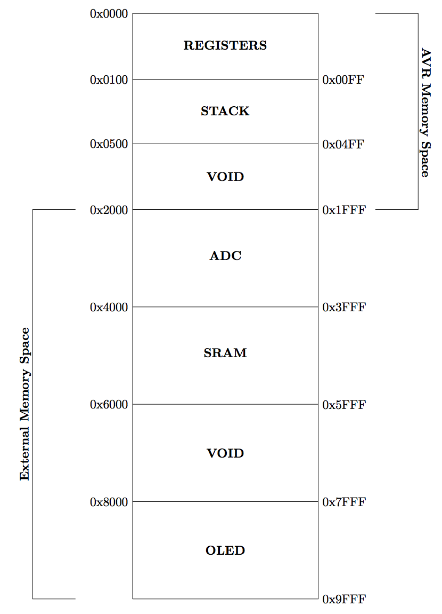

# TTK4155 gruppe 20 2016

The term project for TTK4155 (byggern) for group 20 2016.

## File structure

The library is shared between the two nodes, and can be found in the lib folder. Every class has its own folder, with its own .h and .cpp file.

If a library is specific to one chip, for example the ATmega162, we have included a `#ifdef __AVR_ATmega162__` in the header file. This define is set by the compiler.

The node specific code is located in the node(1/2) / src. The *init.cpp* file is ran each time the MCU starts, and *main.cpp* is the main file. The *state_machine.cpp* is the state machine implementation. Please read bellow

### State machine

We have made a state machine for each of the nodes, and is implemented in lib/state_machine. Under *node(1/2) / src / state_machine.cpp* we have specified and implemented the states of the node.

There is one function that runs when a state is entered, one that loops until the state is left, and one that runs when we leave the state. You transition between states by
 `fsm->Transition(STATE_NEXT, 0)`

## Extras

We have implemented a few extra features. They are listed here

### Toolchain and C++

We decided to build our own toolchain, and not use the supplied toolchain in ATMEL Studio. All of our project is done in Linux (except for the GAL), and we used [AVRDUDE](http://www.nongnu.org/avrdude/), [AVR-G++](http://www.nongnu.org/avr-libc/) and [CMake](https://cmake.org/) to build and push the code onto the ATMega.

In stead of using C, we decided to go for C++. Therefor every module is built as a class, with most of them a singleton implementation.

We used the [minicom](https://help.ubuntu.com/community/Minicom) software to read UART messages.

### Extended memory map

The memory map has been extended from 2KB of SRAM to 8KB of SRAM by not using the JTAG interface and in stead using those pins as memory pins. This caused us to gain a new memory map, as can be seen bellow.

### Highscore, nRF51 chip and Bluetooth

We have implemented a highscore system, that stores the highscore in the EEPROM at the ATmega162. The scoring system is based on time, and the longer you play the higher score you get. This is realized through a timer module in the ATmega2560.

When a game ends, you are prompted to enter your name at the OLED screen. You enter this name by using an android app we have developed, which communicates with a nRF51 (from now on node 3) dev board through bluetooth.

When node 3 receives the name, it is sent to node 2 through SPI. Node 2 then sends the name to node 1, which stores the name in the EEPROM if the highscore is good enough.

This highscore can later be found by the menu entry "Highscore". You can also clear the highscore here through the menu entry clear.

**You can find the code for the nRF51 chip and the android code in the extra folder.**

### Render OLED from Node 2 over CAN

It is possible to render the OLED from node 2 through the CAN network. At the moment, it does render fast enough for it to be a viable option, but we have included a menu entry which illustrates that it is possible.

This is done through the SCP protocol that we developed for this project. Please refer to the documentation and the SCP class. We send a CAN message with SCP instruction node 1 to write to a specific memory address. The OLED addresses and data is calculated at node 2.
